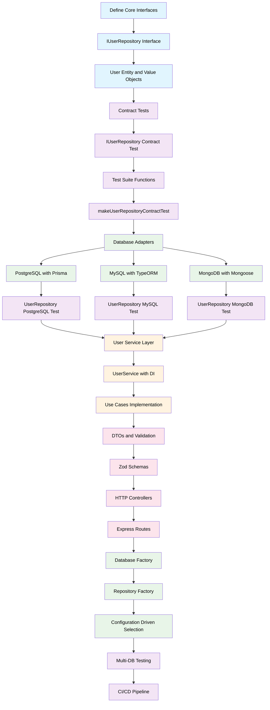

# Arquitectura TDD de Usuarios - Flujo de Implementación

## Resumen

Este documento describe la arquitectura de Desarrollo Dirigido por Pruebas (TDD) para implementar la gestión de datos de usuarios en nuestro sistema multi-base de datos. La arquitectura sigue los principios de Clean Architecture con un diseño agnóstico de base de datos que soporta PostgreSQL, MySQL y MongoDB.

## Diagrama de Flujo de Implementación



## Fases de Implementación

### Fase 1: Dominio Central e Interfaces

#### 1.1 Entidades de Dominio
```typescript
// src/core/domain/entities/User.ts
export class User {
  constructor(
    public readonly id: string,
    public readonly email: Email,
    public readonly passwordHash: string,
    public readonly role: UserRole,
    public readonly createdAt: Date,
    public readonly updatedAt: Date
  ) {}
}
```

#### 1.2 Interface del Repository
```typescript
// src/core/interfaces/repositories/IUserRepository.ts
export interface IUserRepository {
  create(userData: CreateUserData): Promise<User>;
  findById(id: string): Promise<User | null>;
  findByEmail(email: string): Promise<User | null>;
  update(id: string, updateData: UpdateUserData): Promise<User | null>;
  delete(id: string): Promise<void>;
}
```

### Fase 2: Testing de Contratos

#### 2.1 Suite de Tests de Contrato
```typescript
// src/core/interfaces/repositories/__tests__/IUserRepository.contract.test.ts
export function makeUserRepositoryContractTest(
  description: string,
  setupRepository: () => {
    repository: IUserRepository;
    cleanDatabase: () => Promise<void>;
    verifyUserInDatabase: (id: string) => Promise<boolean>;
  },
  teardownRepository: () => Promise<void>
) {
  // Tests de contrato que todas las implementaciones deben pasar
}
```

### Fase 3: Implementaciones de Base de Datos

#### 3.1 Implementación PostgreSQL
```typescript
// src/infrastructure/database/adapters/prisma/repositories/PrismaUserRepository.ts
export class PrismaUserRepository implements IUserRepository {
  constructor(private prisma: PrismaClient) {}
  // Implementación usando Prisma
}
```

#### 3.2 Tests de Integración
```typescript
// __tests__/integration/postgresql/UserRepository.pg.test.ts
makeUserRepositoryContractTest(
  'PrismaUserRepository Integration Tests',
  () => ({
    repository: new PrismaUserRepository(testPrismaClient),
    cleanDatabase: () => TestDatabaseUtils.cleanDatabase(testPrismaClient),
    verifyUserInDatabase: async (id: string) => {
      const user = await testPrismaClient.user.findUnique({ where: { id } });
      return user !== null;
    }
  }),
  async () => {
    await TestDatabaseUtils.disconnectPrismaClient(testPrismaClient);
  }
);
```

### Fase 4: Capa de Servicios

#### 4.1 Casos de Uso
```typescript
// src/core/use-cases/users/CreateUserUseCase.ts
export class CreateUserUseCase {
  constructor(
    @inject('IUserRepository') private userRepository: IUserRepository,
    @inject('IPasswordService') private passwordService: IPasswordService
  ) {}
}
```

#### 4.2 Implementación del Servicio
```typescript
// src/modules/users/services/UserService.ts
export class UserService {
  constructor(
    private createUserUseCase: CreateUserUseCase,
    private updateUserUseCase: UpdateUserUseCase
  ) {}
}
```

### Fase 5: Capa de API

#### 5.1 DTOs y Validación
```typescript
// src/modules/users/dto/CreateUserDto.ts
export const CreateUserSchema = z.object({
  email: z.string().email(),
  password: z.string().min(8),
  role: z.enum(['student', 'content_creator', 'admin'])
});

export type CreateUserDto = z.infer<typeof CreateUserSchema>;
```

#### 5.2 Controladores
```typescript
// src/modules/users/controllers/UserController.ts
export class UserController {
  constructor(private userService: UserService) {}
  
  async create(req: Request, res: Response): Promise<void> {
    const userData = CreateUserSchema.parse(req.body);
    // Implementación
  }
}
```

### Fase 6: Patrón Factory

#### 6.1 Factory de Base de Datos
```typescript
// src/infrastructure/database/factories/DatabaseFactory.ts
export class DatabaseFactory {
  static createUserRepository(): IUserRepository {
    switch (config.database.type) {
      case 'postgresql': return new PrismaUserRepository(prismaClient);
      case 'mysql': return new TypeORMUserRepository(typeormConnection);
      case 'mongodb': return new MongoUserRepository(mongooseConnection);
    }
  }
}
```

## Estrategia de Testing

### Matriz de Testing Multi-Base de Datos

| Tipo de Test | PostgreSQL | MySQL | MongoDB | Propósito |
|--------------|------------|-------|---------|-----------|
| Tests de Contrato | ✅ | ✅ | ✅ | Asegurar cumplimiento de interfaces |
| Tests de Integración | ✅ | ✅ | ✅ | Validar operaciones de base de datos |
| Tests de Performance | ✅ | ✅ | ✅ | Comparar implementaciones |
| Tests E2E | ✅ | ✅ | ✅ | Validación de flujo completo |

### Pipeline CI/CD

```yaml
# .github/workflows/ci.yml
strategy:
  matrix:
    database: [postgresql, mysql, mongodb]
    node-version: [22.x]
```

## Beneficios Clave

1. **Agnóstico de Base de Datos**: Cambiar entre bases de datos sin modificar la lógica de negocio
2. **Cumplimiento de Contratos**: Todas las implementaciones garantizadas para funcionar de la misma manera
3. **Enfoque TDD**: Los tests dirigen el diseño y aseguran la calidad
4. **Arquitectura Limpia**: Separación clara de responsabilidades
5. **Escalable**: Fácil agregar nuevas implementaciones de base de datos

## Orden de Implementación

1. ✅ Definir interfaces centrales y entidades
2. ✅ Crear suite de tests de contrato
3. ⌛ Implementar adaptador PostgreSQL (Prisma)
4. 🔄 Implementar adaptador MySQL (TypeORM)
5. 🔄 Implementar adaptador MongoDB (Mongoose)
6. 🔄 Crear capa de servicios con inyección de dependencias
7. 🔄 Construir capa de API con validación
8. 🔄 Implementar patrón factory
9. 🔄 Configurar CI/CD con testing multi-base de datos

## Próximos Pasos

- Completar la implementación de PostgreSQL siguiendo los tests de contrato
- Extender a implementaciones de MySQL y MongoDB
- Implementar la capa de servicios con inyección de dependencias apropiada
- Crear documentación completa de la API
- Configurar benchmarking de performance entre bases de datos