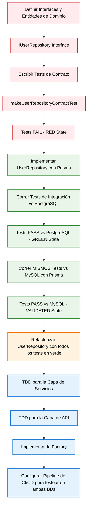

# Arquitectura TDD de Usuarios - Flujo de Implementación

## Resumen

Este documento describe la arquitectura de Desarrollo Dirigido por Pruebas (TDD) para implementar la gestión de datos de usuarios en nuestro sistema multi-base de datos. La arquitectura sigue los principios de Clean Architecture con un diseño agnóstico de base de datos que soporta PostgreSQL y MySQL usando Prisma como ORM único.

## Diagrama de Flujo de Implementación



## Fases de Implementación TDD

### Fase 1: Diseño de Interfaces (Interface First)

#### 1.1 ✅ Entidades de Dominio

```typescript
// src/core/domain/entities/User.ts
export class User {
  constructor(
    public readonly id: string,
    public readonly email: Email,
    public readonly passwordHash: HashedPassword,
    public readonly role: Role,
    public readonly createdAt: Date,
    public readonly updatedAt: Date
  ) {
    this.validateConstructorParams();
  }

  // Métodos de utilidad implementados
  canCreateContent(): boolean {
    return this.role.canCreateContent();
  }
  hasAdminPrivileges(): boolean {
    return this.role.hasAdminPrivileges();
  }
  isStudent(): boolean {
    return this.role.isStudent();
  }
  isContentCreator(): boolean {
    return this.role.isContentCreator();
  }
  isAdmin(): boolean {
    return this.role.isAdmin();
  }

  // Getters para APIs
  getEmailValue(): string {
    return this.email.value;
  }
  getRoleValue(): string {
    return this.role.value;
  }
  getPasswordHashValue(): string {
    return this.passwordHash.value;
  }
}
```

**Value Objects Implementados:**

- ✅ `Email`: Validación de formato de email
- ✅ `HashedPassword`: Validación de hash bcrypt
- ✅ `PlainPassword`: Validación de contraseña plana con reglas de fortaleza
- ✅ `Role`: Roles de usuario con métodos de autorización

#### 1.2 ✅ Interface del Repository

```typescript
// src/core/interfaces/repositories/IUserRepository.ts
export interface IUserRepository {
  create(userData: CreateUserData): Promise<User>;
  findById(id: string): Promise<User | null>;
  findByEmail(email: string): Promise<User | null>;
  update(id: string, updateData: UpdateUserData): Promise<User | null>;
  delete(id: string): Promise<void>;
}

export interface CreateUserData {
  email: string;
  passwordHash: string;
  role: string;
}

export interface UpdateUserData {
  email?: string;
  passwordHash?: string;
  role?: string;
}
```

### Fase 2: Tests de Contrato PRIMERO (RED)

#### 2.1 Escribir Tests ANTES de Implementar

```typescript
// src/core/interfaces/repositories/__tests__/IUserRepository.contract.test.ts
export function makeUserRepositoryContractTest(
  description: string,
  setupRepository: () => {
    repository: IUserRepository;
    cleanDatabase: () => Promise<void>;
    verifyUserInDatabase: (id: string) => Promise<boolean>;
  },
  teardownRepository: () => Promise<void>
) {
  // Tests de contrato que todas las implementaciones deben pasar
}
```

### Fase 3: Primera Implementación (GREEN)

#### 3.1 Implementar UserRepository con Prisma para Pasar Tests

```typescript
// src/infrastructure/database/adapters/prisma/repositories/UserRepository.ts
export class UserRepository implements IUserRepository {
  constructor(private prisma: PrismaClient) {}
  // Implementación usando Prisma que funciona con PostgreSQL y MySQL
}
```

#### 3.2 Tests de Integración

```typescript
// __tests__/integration/postgresql/UserRepository.pg.test.ts
makeUserRepositoryContractTest(
  'UserRepository Integration Tests - PostgreSQL',
  () => ({
    repository: new UserRepository(testPrismaClient),
    cleanDatabase: () => TestDatabaseUtils.cleanDatabase(testPrismaClient),
    verifyUserInDatabase: async (id: string) => {
      const user = await testPrismaClient.user.findUnique({ where: { id } });
      return user !== null;
    },
  }),
  async () => {
    await TestDatabaseUtils.disconnectPrismaClient(testPrismaClient);
  }
);
```

```typescript
// __tests__/integration/mysql/UserRepository.mysql.test.ts
makeUserRepositoryContractTest(
  'UserRepository Integration Tests - MySQL',
  () => ({
    repository: new UserRepository(testPrismaClient),
    cleanDatabase: () => TestDatabaseUtils.cleanDatabase(testPrismaClient),
    verifyUserInDatabase: async (id: string) => {
      const user = await testPrismaClient.user.findUnique({ where: { id } });
      return user !== null;
    },
  }),
  async () => {
    await TestDatabaseUtils.disconnectPrismaClient(testPrismaClient);
  }
);
```

### Fase 4: Capa de Servicios

#### 4.1 Casos de Uso

```typescript
// src/core/use-cases/users/CreateUserUseCase.ts
export class CreateUserUseCase {
  constructor(
    @inject('IUserRepository') private userRepository: IUserRepository,
    @inject('IPasswordService') private passwordService: IPasswordService
  ) {}
}
```

#### 4.2 Implementación del Servicio

```typescript
// src/modules/users/services/UserService.ts
export class UserService {
  constructor(
    private createUserUseCase: CreateUserUseCase,
    private updateUserUseCase: UpdateUserUseCase
  ) {}
}
```

### Fase 5: Capa de API

#### 5.1 DTOs y Validación

```typescript
// src/modules/users/dto/CreateUserDto.ts
export const CreateUserSchema = z.object({
  email: z.string().email(),
  password: z.string().min(8),
  role: z.enum(['student', 'content_creator', 'admin']),
});

export type CreateUserDto = z.infer<typeof CreateUserSchema>;
```

#### 5.2 Controladores

```typescript
// src/modules/users/controllers/UserController.ts
export class UserController {
  constructor(private userService: UserService) {}

  async create(req: Request, res: Response): Promise<void> {
    const userData = CreateUserSchema.parse(req.body);
    // Implementación
  }
}
```

### Fase 6: Patrón Factory

#### 6.1 Factory de Base de Datos

```typescript
// src/infrastructure/database/factories/DatabaseFactory.ts
export class DatabaseFactory {
  static createUserRepository(): IUserRepository {
    // Prisma maneja múltiples bases de datos con el mismo cliente
    // La configuración se hace a nivel de schema y connection string
    return new UserRepository(prismaClient);
  }
}
```

**Configuración Multi-Base de Datos con Prisma:**

```typescript
// src/infrastructure/database/config/prisma.config.ts
export const createPrismaClient = (): PrismaClient => {
  const databaseUrl = config.database.provider === 'postgresql' 
    ? config.database.postgresUrl 
    : config.database.mysqlUrl;
    
  return new PrismaClient({
    datasources: {
      db: { url: databaseUrl }
    }
  });
};
```

## Estrategia de Testing

### Matriz de Testing Multi-Base de Datos

| Tipo de Test         | PostgreSQL | MySQL | Propósito                            |
| -------------------- | ---------- | ----- | ------------------------------------ |
| Tests de Contrato    | ✅         | ✅    | Asegurar cumplimiento de interfaces  |
| Tests de Integración | ✅         | ✅    | Validar operaciones de base de datos |
| Tests de Performance | ✅         | ✅    | Comparar rendimiento entre BDs       |
| Tests E2E            | ✅         | ✅    | Validación de flujo completo         |

### Pipeline CI/CD

```yaml
# .github/workflows/ci.yml
strategy:
  matrix:
    database: [postgresql, mysql]
    node-version: [22.x]

jobs:
  test:
    runs-on: ubuntu-latest
    steps:
      - uses: actions/checkout@v4
      - name: Setup Node.js
        uses: actions/setup-node@v4
        with:
          node-version: ${{ matrix.node-version }}
      - name: Install dependencies
        run: npm ci
      - name: Run integration tests
        run: npm run test:integration:${{ matrix.database }}
```

## Principios TDD Aplicados

### Ciclo Red-Green-Refactor

1. **🔴 RED**: Escribir un test que falle
   - Definir el comportamiento esperado ANTES de implementar
   - Los tests actúan como especificación ejecutable
   - Garantiza que el test realmente valida la funcionalidad

2. **🟢 GREEN**: Escribir el código mínimo para pasar el test
   - Implementar solo lo necesario para que el test pase
   - No optimizar prematuramente
   - Enfocarse en hacer que funcione

3. **🟡 REFACTOR**: Mejorar el código sin cambiar funcionalidad
   - Limpiar el código manteniendo los tests verdes
   - Aplicar patrones de diseño
   - Optimizar performance si es necesario

### Aplicación en Nuestro Proyecto

- **Tests de Contrato**: Definen el comportamiento que la implementación debe cumplir en ambas BDs
- **Implementación Única**: Una sola implementación con Prisma funciona en PostgreSQL y MySQL
- **Validación Continua**: Los tests garantizan que la implementación funciona consistentemente en ambas BDs

## Beneficios Clave

1. **TDD Auténtico**: Tests escritos ANTES que implementaciones, dirigiendo el diseño
2. **Agnóstico de Base de Datos**: Cambiar entre PostgreSQL y MySQL sin modificar la lógica de negocio
3. **Cumplimiento de Contratos**: Una implementación garantizada para funcionar consistentemente en ambas BDs
4. **Calidad por Diseño**: Los tests actúan como especificación ejecutable
5. **Refactoring Seguro**: Cambios con confianza gracias a la cobertura de tests
6. **Arquitectura Limpia**: Separación clara de responsabilidades
7. **Simplicidad**: Una sola implementación con Prisma reduce complejidad y mantenimiento
8. **Testcontainers**: Tests de integración con bases de datos reales en contenedores efímeros

## Orden de Implementación TDD (Red-Green-Refactor)

### Ciclo 1: Repository Layer

1. ✅ **RED**: Definir interfaces y escribir tests de contrato (IMPLEMENTADO)
2. ✅ **RED**: Crear suite de tests que debe pasar la implementación (IMPLEMENTADO)
3. ✅ **GREEN**: Implementar UserRepository con Prisma para PostgreSQL (IMPLEMENTADO)
4. ✅ **GREEN**: Validar que la misma implementación funciona con MySQL (IMPLEMENTADO)
5. ✅ **REFACTOR**: Optimizar implementación y configuración multi-BD (IMPLEMENTADO)

**Estado Actual del Proyecto:**

**Domain Layer:**
- ✅ User entity con validaciones completas
- ✅ Value objects: Email, Password (Plain/Hashed), Role
- ✅ IUserRepository interface definida
- ✅ Tests unitarios para User entity
- ✅ Tests de contrato para IUserRepository

**Repository Layer:**
- ✅ UserRepository implementado con Prisma
- ✅ Tests de integración con PostgreSQL funcionando
- ✅ Tests de integración con MySQL funcionando
- ✅ Testcontainers configurado para ambas BDs
- ✅ Configuración de Jest para módulos ES (uuid) resuelta

### Ciclo 2: Service Layer

7. 🔄 **RED**: Escribir tests de servicios y casos de uso PRIMERO
8. 🔄 **GREEN**: Implementar servicios para pasar tests
9. 🔄 **REFACTOR**: Optimizar inyección de dependencias

### Ciclo 3: API Layer

10. 🔄 **RED**: Escribir tests de controladores y validación PRIMERO
11. 🔄 **GREEN**: Implementar controladores y DTOs para pasar tests
12. 🔄 **REFACTOR**: Optimizar validación con Zod

### Ciclo 4: Factory Pattern

13. 🔄 **RED**: Escribir tests de factory pattern PRIMERO
14. 🔄 **GREEN**: Implementar factory para pasar tests
15. 🔄 **REFACTOR**: Configurar CI/CD con testing multi-base de datos

## Próximos Pasos Inmediatos

### Fase Actual: Service Layer (Próximo Ciclo TDD)

**Repository Layer Completado:**
1. ✅ **UserRepository implementado** con Prisma funcionando en PostgreSQL y MySQL
2. ✅ **Tests de contrato pasando** en ambas bases de datos
3. ✅ **Tests de integración** con Testcontainers configurados
4. ✅ **Configuración de Jest** para módulos ES resuelta

### Siguientes Fases:

- **Service Layer**: Implementar casos de uso con inyección de dependencias
- **API Layer**: Crear DTOs, validación con Zod y controladores HTTP
- **Factory Pattern**: Configurar selección dinámica de base de datos
- **Performance Testing**: Benchmarking entre PostgreSQL y MySQL
- **CI/CD Pipeline**: Automatizar tests en ambas bases de datos
- **Documentación API**: OpenAPI/Swagger para endpoints

### Estado Actualizado del Proyecto:

- ✅ **Domain Layer**: Completamente implementado con TDD
- ✅ **Repository Layer**: Implementado y validado en PostgreSQL y MySQL
- 🔄 **Service Layer**: Próximo en implementar
- 🔄 **API Layer**: Pendiente
- 🔄 **Factory Pattern**: Pendiente

### Configuración de Testing Actual:

```bash
# Tests unitarios
npm run test:unit

# Tests de integración PostgreSQL
npm run test:integration:postgres

# Tests de integración MySQL  
npm run test:integration:mysql

# Tests en ambas bases de datos
npm run test:all-dbs
```

**Resultados de Testing:**
- ✅ PostgreSQL: 2 test suites passed, 10 tests passed
- ✅ MySQL: 2 test suites passed, 10 tests passed
- ✅ UUID ES module issue: Resuelto con wrapper CommonJS
- ✅ Testcontainers: Funcionando correctamente
